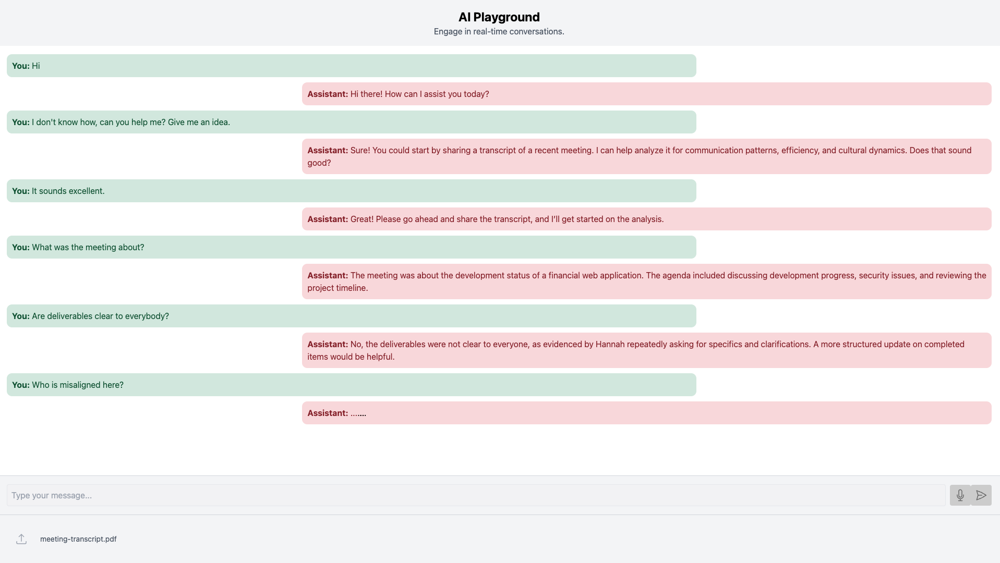

# Multimodal AI Assistant Playground

This project is a playground for building a Multimodal AI Assistant with a Flask backend and a React frontend. The project currently supports real-time messaging and PDF file uploads for context.



## Features

- Real-time messaging
- PDF File Upload for context
- System Prompt defined for AI Assistant
- Conversation context stored in session cookie

## Tech Stack

- **Backend**: Python, Flask, Redis, Azure OpenAI GPT-4 Omni
- **Frontend**: React, Tailwind CSS, TypeScript

## Environment Variables

Create a `.env` file with the following variables:

```
FLASK_ENV=development
CHOKIDAR_USEPOLLING=true
AZURE_OPENAI_API_KEY=your_azure_openai_api_key
AZURE_OPENAI_ENDPOINT=your_azure_openai_endpoint
REDIS_HOST=your_redis_host (default: localhost)
REDIS_PORT=your_redis_port (default: 6379)
REACT_APP_BACKEND_URL=http://localhost:5000
```

## Real-time Messaging

The application supports real-time messaging with the AI assistant. Users can send messages and receive responses in real-time.

### Backend Implementation

The backend implementation for handling chat messages is in the [`chat.py`](backend/app/chat.py) file. It includes the following key functions:

- `create_chat_client()`: Creates a client for the Azure OpenAI API using the provided API key and endpoint.
- `chat(client, messages)`: Sends the conversation history to the Azure OpenAI API and retrieves the assistant's response.
- `extract_message(chat_result)`: Extracts the assistant's message from the API response.
- `chat_route()`: Handles the chat API endpoint, processes user messages, and updates the conversation history.

### Frontend Implementation

The frontend implementation for sending chat messages is in the [`ChatInput.tsx`](frontend/src/components/ChatInput.tsx) file. It includes the following key components:

- `ChatInput`: A React component that allows users to type and send messages. It handles input changes, form submission, and displays the send button.

## PDF File Upload for Context

The application supports uploading PDF files to provide additional context for the AI assistant. The uploaded PDF files are processed, and their text content is extracted and added to the conversation history.

### Backend Implementation

The backend implementation for handling PDF file uploads is in the [`file.py`](backend/app/file.py) file. It includes the following key functions:

- `allowed_file(filename)`: Checks if the uploaded file is a PDF.
- `upload_file(chat_client_creator=create_chat_client)`: Handles the file upload, saves the file, extracts text from the PDF, and updates the conversation history.

### Frontend Implementation

The frontend implementation for uploading PDF files is in the [`FileUpload.tsx`](frontend/src/components/FileUpload.tsx) file. It includes the following key components:

- `FileUpload`: A React component that allows users to upload PDF files. It handles file selection, displays upload progress, and shows any errors.

### API Integration

The API integration for sending messages and uploading PDF files is in the [`api.ts`](frontend/src/services/api.ts) file. It includes the following key functions:

- `sendMessage(message: string)`: Sends a chat message to the backend for processing.
- `sendFile(file: File)`: Sends the selected PDF file to the backend for processing.

## Project Structure

```
multimodal-ai-assistant
├── assets
│   └── ai-assistant-screenshot.png
├── backend
│   ├── app
│   │   ├── __init__.py
│   │   ├── chat.py
│   │   ├── config.py
│   │   ├── file.py
│   └── requirements.txt
├── frontend
│   ├── public
│   │   ├── index.html
│   └── src
│       ├── components
│       │   ├── Chat.tsx
│       │   ├── ChatInput.tsx
│       │   ├── Message.tsx
│       │   ├── FileUpload.tsx
│       │   └── Chat.css
│       ├── hooks
│       │   └── useChat.ts
│       ├── services
│       │   └── api.ts
│       ├── App.tsx
│       ├── index.tsx
│       ├── index.css
│       └── setupProxy.js
├── docker-compose.yml
├── .env
└── README.md
```

## Backend Setup

1. Navigate to the `backend` directory.
2. Create a virtual environment:
   ```sh
   python -m venv venv
   ```
3. Activate the virtual environment:
   - On Windows:
     ```sh
     venv\Scripts\activate
     ```
   - On macOS/Linux:
     ```sh
     source venv/bin/activate
     ```
4. Install the required dependencies:
   ```sh
   pip install -r requirements.txt
   ```
5. Run the Flask application:
   ```sh
   python run.py
   ```

## Frontend Setup

1. Navigate to the `frontend` directory.
2. Install the required dependencies:
   ```sh
   npm install
   ```
3. Start the React application:
   ```sh
   npm start
   ```

## Running with Docker

1. Ensure Docker is installed and running on your machine.
2. Navigate to the root directory of the project.
3. Build and start the services using Docker Compose:
   ```sh
   docker-compose up --build
   ```

## System Prompt

The AI Assistant is initialized with a system prompt that defines its behavior and response style. This prompt ensures that the assistant provides concise and actionable insights during conversations.

## Conversation Context

The AI Assistant maintains the conversation context by storing the conversation history in a session cookie. This allows the assistant to provide coherent and contextually relevant responses throughout the interaction.

## License

This project is open-source and available under the MIT License.
