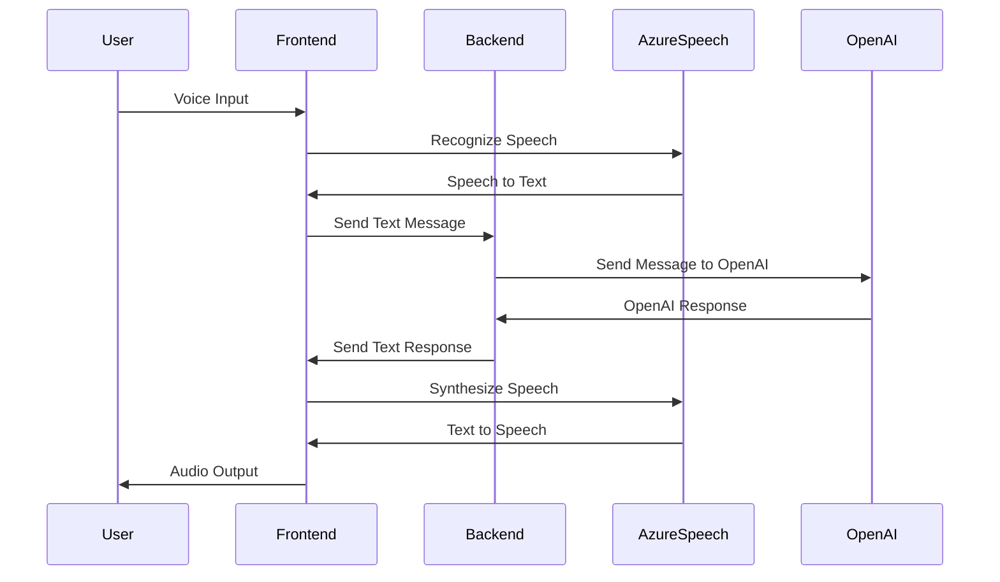
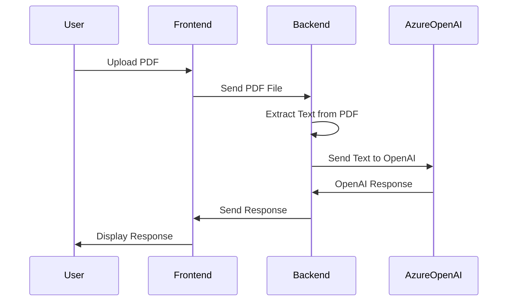

# Multimodal AI Assistant Playground

This project is a playground for building a Multimodal AI Assistant with a Flask backend and a React frontend. The project currently supports real-time messaging, PDF file uploads for context, and speech (both text-to-speech/speech-to-text).


## Features

- Real-time messaging
- PDF File Upload for context
- Speech (both text-to-speech/speech-to-text)
- System Prompt defined for AI Assistant
- Conversation context stored in session cookie
- Visual feedback with thinking dots during AI response generation
- AI assistant's responses are typed as a human would do it, enhancing the human touch and usability

## Tech Stack

- **Backend**: Python, Flask, Redis, Azure OpenAI GPT-4 Omni
- **Frontend**: React, Tailwind CSS, TypeScript
- **Speech**: Microsoft Cognitive Services Speech SDK

## Environment Variables

Create a `.env` file with the following variables:

```
FLASK_ENV=development
CHOKIDAR_USEPOLLING=true
AZURE_OPENAI_API_KEY=your_azure_openai_api_key
AZURE_OPENAI_ENDPOINT=your_azure_openai_endpoint
AZURE_SPEECH_KEY=your_azure_speech_key
AZURE_SPEECH_REGION=your_azure_speech_region
REDIS_HOST=your_redis_host (default: localhost)
REDIS_PORT=your_redis_port (default: 6379)
REACT_APP_BACKEND_URL=http://localhost:5000
REACT_APP_AZURE_SPEECH_KEY=your_azure_speech_key
REACT_APP_AZURE_SPEECH_REGION=your_azure_speech_region
```

## Project Structure

```
multimodal-ai-assistant
├── assets
│   └── ai-assistant-screenshot.png
├── backend
│   ├── app
│   │   ├── __init__.py
│   │   ├── chat.py
│   │   ├── config.py
│   │   ├── file.py
│   │   ├── speech.py
│   └── requirements.txt
├── frontend
│   ├── public
│   │   ├── index.html
│   └── src
│       ├── components
│       │   ├── Chat.tsx
│       │   ├── ChatInput.tsx
│       │   ├── Message.tsx
│       │   ├── FileUpload.tsx
│       │   └── Chat.css
│       ├── hooks
│       │   └── useSpeech.ts
│       ├── services
│       │   └── api.ts
│       ├── App.tsx
│       ├── index.tsx
│       ├── index.css
│       └── setupProxy.js
├── docker-compose.yml
├── .env
└── README.md
```

## Backend Setup

1. Navigate to the `backend` directory.
2. Create a virtual environment:
   ```sh
   python -m venv venv
   ```
3. Activate the virtual environment:
   - On Windows:
     ```sh
     venv\Scripts\activate
     ```
   - On macOS/Linux:
     ```sh
     source venv/bin/activate
     ```
4. Install the required dependencies:
   ```sh
   pip install -r requirements.txt
   ```
5. Run the Flask application:
   ```sh
   python run.py
   ```

## Frontend Setup

1. Navigate to the `frontend` directory.
2. Install the required dependencies:
   ```sh
   npm install
   ```
3. Start the React application:
   ```sh
   npm start
   ```

## Running with Docker

1. Ensure Docker is installed and running on your machine.
2. Navigate to the root directory of the project.
3. Build and start the services using Docker Compose:
   ```sh
   docker-compose up --build
   ```

## System Prompt

The AI Assistant is initialized with a system prompt that defines its behavior and response style. This prompt ensures that the assistant provides concise and actionable insights during conversations.

## Conversation Context

The AI Assistant maintains the conversation context by storing the conversation history in a session cookie. This allows the assistant to provide coherent and contextually relevant responses throughout the interaction.

## Speech-to-Text and Text-to-Speech Flow



## PDF Upload Flow



## License

This project is open-source and available under the MIT License.
