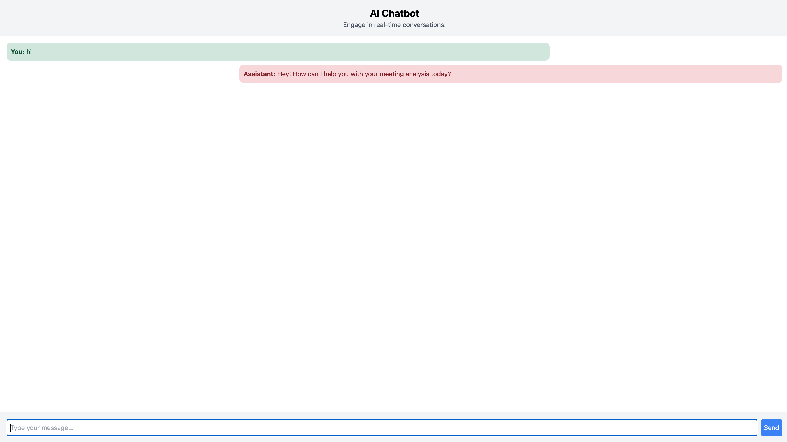

# Multimodal AI Assistant

This project is a Multimodal AI Assistant built with a Flask backend and a React frontend. The project is a work in progress and currently has a chat feature.



## Features

- Real-time messaging
- System Prompt defined for AI Assistant
- Conversation context stored in session cookie

## Tech Stack

- **Backend**: Python, Flask, Redis, Azure OpenAI GPT-4 Omni
- **Frontend**: React, Tailwind CSS, TypeScript

## Environment Variables

Create a `.env` file with the following variables:

```
FLASK_ENV=development
CHOKIDAR_USEPOLLING=true
AZURE_OPENAI_API_KEY=your_azure_openai_api_key
AZURE_OPENAI_ENDPOINT=your_azure_openai_endpoint
REDIS_HOST=your_redis_host (default: localhost)
REDIS_PORT=your_redis_port (default: 6379)
REACT_APP_BACKEND_URL=http://localhost:5000
```

## Project Structure

```
multimodal-ai-assistant
├── assets
│   └── ai-assistant-screenshot.png
├── backend
│   ├── app
│   │   ├── __init__.py
│   │   ├── chat.py
│   │   ├── config.py
│   └── requirements.txt
├── frontend
│   ├── public
│   │   ├── index.html
│   └── src
│       ├── components
│       │   ├── Chat.tsx
│       │   ├── ChatInput.tsx
│       │   ├── Message.tsx
│       │   └── Chat.css
│       ├── hooks
│       │   └── useChat.ts
│       ├── services
│       │   └── api.ts
│       ├── App.tsx
│       ├── index.tsx
│       ├── index.css
│       └── setupProxy.js
├── docker-compose.yml
├── .env
└── README.md
```

## Backend Setup

1. Navigate to the `backend` directory.
2. Create a virtual environment:
   ```sh
   python -m venv venv
   ```
3. Activate the virtual environment:
   - On Windows:
     ```sh
     venv\Scripts\activate
     ```
   - On macOS/Linux:
     ```sh
     source venv/bin/activate
     ```
4. Install the required dependencies:
   ```sh
   pip install -r requirements.txt
   ```
5. Run the Flask application:
   ```sh
   python run.py
   ```

## Frontend Setup

1. Navigate to the `frontend` directory.
2. Install the required dependencies:
   ```sh
   npm install
   ```
3. Start the React application:
   ```sh
   npm start
   ```

## Running with Docker

1. Ensure Docker is installed and running on your machine.
2. Navigate to the root directory of the project.
3. Build and start the services using Docker Compose:
   ```sh
   docker-compose up --build
   ```

## System Prompt

The AI Assistant is initialized with a system prompt that defines its behavior and response style. This prompt ensures that the assistant provides concise and actionable insights during conversations.

## Conversation Context

The AI Assistant maintains the conversation context by storing the conversation history in a session cookie. This allows the assistant to provide coherent and contextually relevant responses throughout the interaction.

## License

This project is open-source and available under the MIT License.
